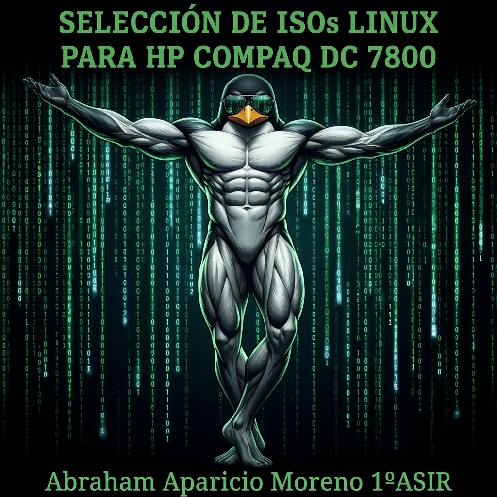

# ENTREGA ÚNICA · Reto 01

---

## 1. Portada

**Alumno/a:** Abraham Aparicio Moreno  
**Grupo:** 1º ASIR  
**Curso:** Sistemas Microinformáticos y Redes / ASIR (UT5)  
**Fecha:** 10/04/2026  

---

## 2. Introducción

El objetivo de este reto es analizar las características de un equipo informático antiguo (HP Compaq dc7800) y seleccionar tres distribuciones Linux compatibles con su hardware. Estas distribuciones se probarán posteriormente en una máquina virtual que simula el equipo real, con el fin de comprobar su funcionamiento e instalación sin conexión a internet.

Este trabajo está relacionado con la UT5, ya que se centra en la selección, instalación y evaluación de sistemas operativos en función de los recursos hardware disponibles.

---

## 3. Análisis del equipo real

El equipo analizado es un HP Compaq dc7800 SFF con las siguientes características principales:

- Procesador Intel Core 2 Duo E6750 (2 núcleos, 64 bits)
- 4 GB de memoria RAM DDR2 a 667 MHz
- Disco duro SATA de 160 GB (HDD mecánico)
- BIOS legacy (sin UEFI)
- Gráficos integrados Intel GMA 3100
- Conectividad Ethernet y adaptador WiFi externo

Se trata de un equipo antiguo con recursos limitados, especialmente en almacenamiento y memoria, lo que hace necesario el uso de distribuciones Linux ligeras. Sin embargo, su CPU de 64 bits y los 4 GB de RAM permiten ejecutar sistemas operativos modernos ligeros con un rendimiento aceptable.

---

## 4. Selección de las 3 ISOs

### 4.1 Criterios usados

Las distribuciones se han seleccionado siguiendo los siguientes criterios:

- Compatibilidad con arquitectura 64 bits
- Bajo consumo de recursos (RAM y CPU)
- Capacidad de instalación sin conexión a internet
- Compatibilidad con BIOS legacy
- Diferentes niveles de exigencia (equilibrada, ligera y ultraligera)
- Facilidad de uso o recuperación del sistema en caso de fallo

---

### 4.2 Tabla comparativa

| ISO | Versión | Arquitectura | RAM mínima | Disco mínimo | Tamaño ISO | Ventajas | Inconvenientes | Decisión |
|-----|--------|--------------|------------|--------------|------------|----------|----------------|----------|
| ISO 01 – Lubuntu | 22.04 LTS | 64 bits | 1 GB (2 GB recomendado) | 10–20 GB | ~2.5 GB | Fácil uso, buena compatibilidad, entorno ligero LXQt | Más pesada que otras opciones, rendimiento menor en HDD | Opción principal |
| ISO 02 – Puppy Linux | Fossapup64 9.5 | 64 bits | 256 MB (512 MB recomendado) | 2–4 GB | ~300–400 MB | Muy ligera, arranque rápido en RAM | Menos intuitiva, menor compatibilidad software | Alternativa |
| ISO 03 – Bodhi Linux | 7.0.0 | 64 bits | 512 MB (1 GB recomendado) | 5–10 GB | ~800 MB – 1 GB | Muy ligera, basada en Ubuntu, buen rendimiento | Menos software preinstalado, interfaz diferente | Respaldo |

---

### 4.3 Ficha resumida de ISO 01

**Distribución:** Lubuntu  
**Versión:** 22.04 LTS  
**Motivo de elección:** Distribución equilibrada, fácil de usar y con buena compatibilidad de hardware.  
**Papel dentro del plan:** Opción principal  

---

### 4.4 Ficha resumida de ISO 02

**Distribución:** Puppy Linux  
**Versión:** Fossapup64 9.5  
**Motivo de elección:** Distribución extremadamente ligera capaz de ejecutarse en equipos antiguos incluso desde RAM.  
**Papel dentro del plan:** Alternativa  

---

### 4.5 Ficha resumida de ISO 03

**Distribución:** Bodhi Linux  
**Versión:** 7.0.0  
**Motivo de elección:** Sistema ligero basado en Ubuntu que ofrece un buen equilibrio entre rendimiento y funcionalidad.  
**Papel dentro del plan:** Respaldo  

---

## 5. Configuración de la máquina virtual

La máquina virtual se configuró para simular el equipo real con las siguientes características:

- CPU: 2 núcleos
- RAM: 2 GB (para pruebas) / 4 GB (simulación completa)
- Disco duro: 160 GB (dinámico)
- Firmware: BIOS (modo legacy)
- Sin conexión a internet durante la instalación
- Montaje de ISOs mediante USB virtual (Ventoy en entorno simulado)

---

## 6. Resultados de las pruebas

### 6.1 ISO 01

**¿Arranca?** Sí  
**¿Entra al instalador?** Sí  
**¿Se instala?** Sí  
**¿Arranca después?** Sí  
**Incidencias:** Posible lentitud en HDD virtual durante instalación  
**Capturas:** (añadir capturas aquí)

---

### 6.2 ISO 02

**¿Arranca?** Sí  
**¿Entra al instalador?** Sí  
**¿Se instala?** Sí (modo frugal o instalación ligera)  
**¿Arranca después?** Sí  
**Incidencias:** Interfaz poco intuitiva y configuración inicial manual  
**Capturas:** (añadir capturas aquí)

---

### 6.3 ISO 03

**¿Arranca?** Sí  
**¿Entra al instalador?** Sí  
**¿Se instala?** Sí  
**¿Arranca después?** Sí  
**Incidencias:** Interfaz diferente a sistemas tradicionales, requiere adaptación  
**Capturas:** (añadir capturas aquí)

---

## 7. Conclusión final

La distribución principal seleccionada es Lubuntu, ya que ofrece el mejor equilibrio entre rendimiento, facilidad de uso y compatibilidad con el hardware del equipo.

Como alternativa se ha seleccionado Puppy Linux, debido a su extrema ligereza y capacidad de funcionamiento en equipos con recursos muy limitados.

Como sistema de respaldo se ha elegido Bodhi Linux, ya que proporciona un entorno ligero basado en Ubuntu con un consumo de recursos reducido y buena estabilidad.

En conjunto, la selección garantiza diferentes niveles de exigencia, asegurando que al menos una distribución funcione correctamente en el equipo real.

---

## 8. Bibliografía

- https://lubuntu.me/
- https://puppylinux.com/
- https://www.bodhilinux.com/ & https://www.bodhilinux.com/w/system-requirements/
