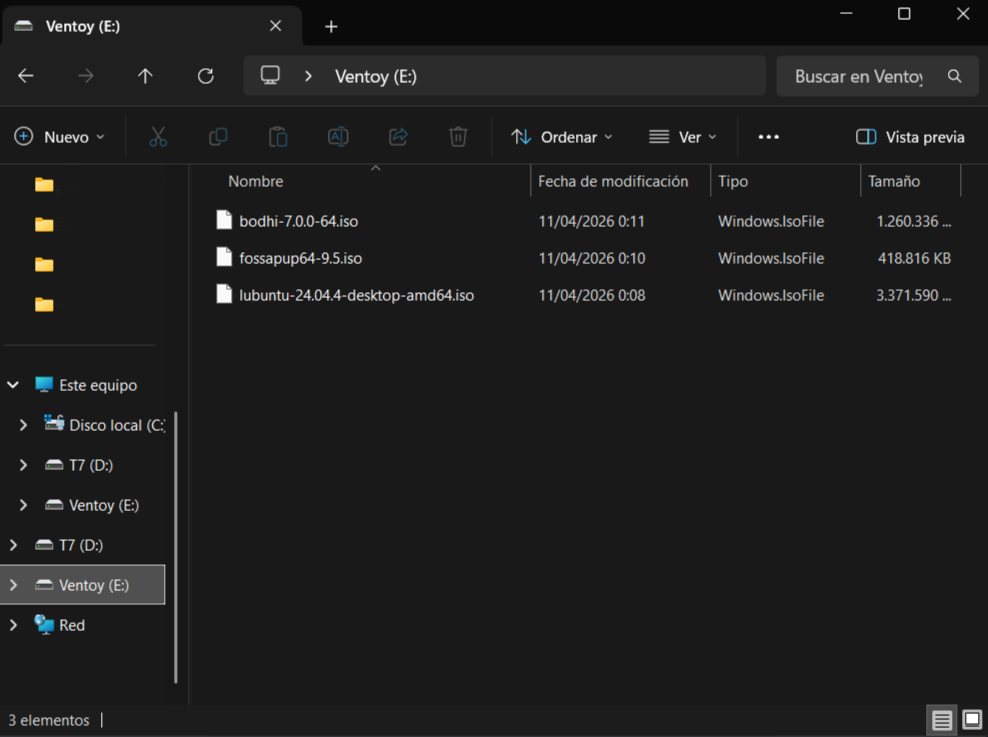
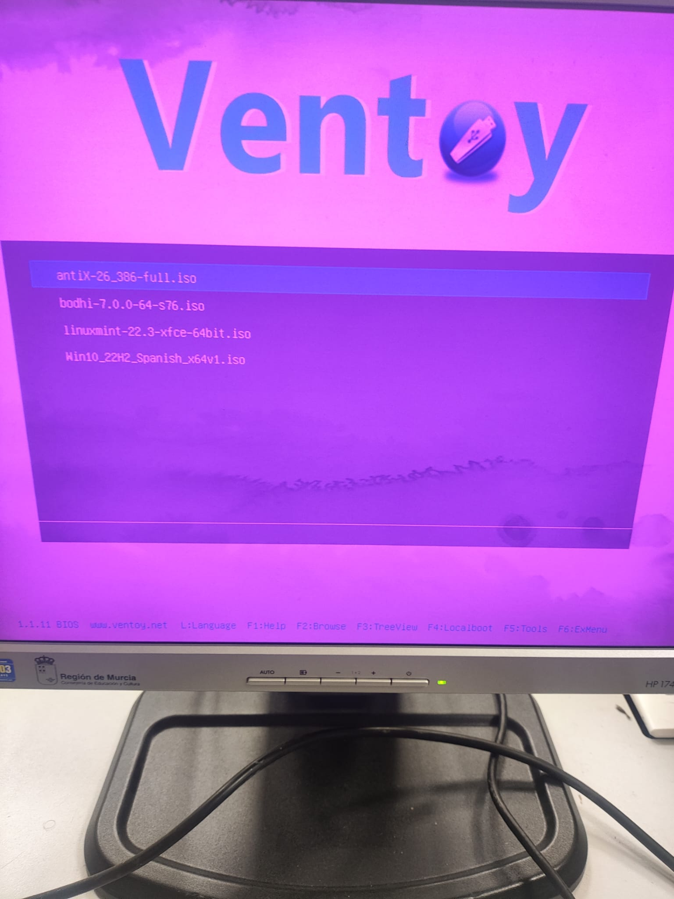
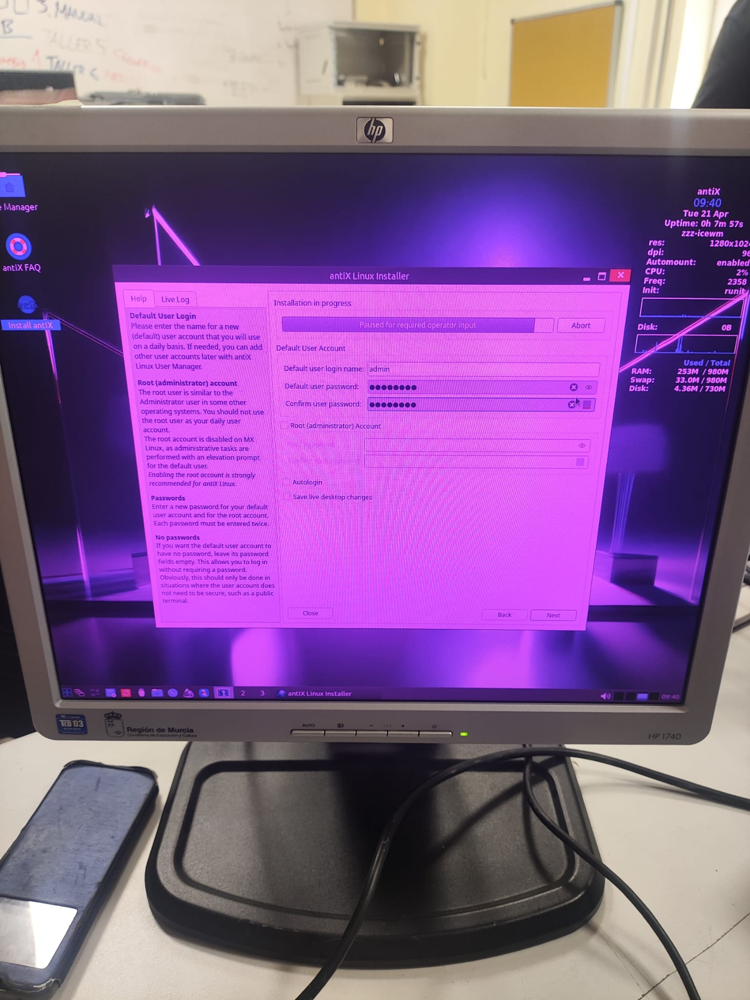
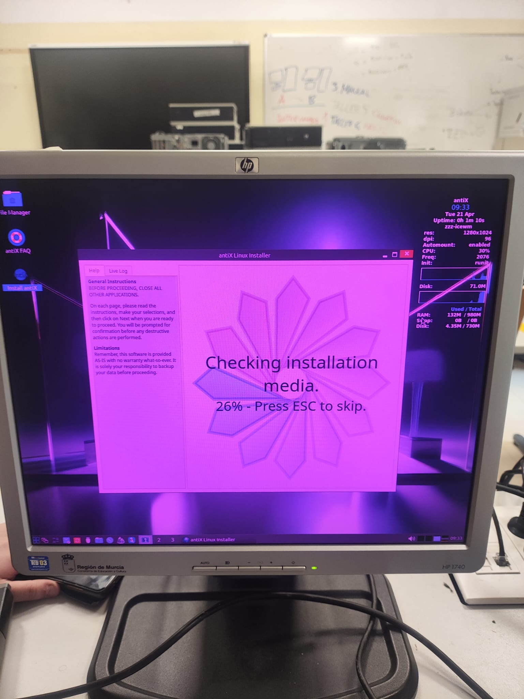
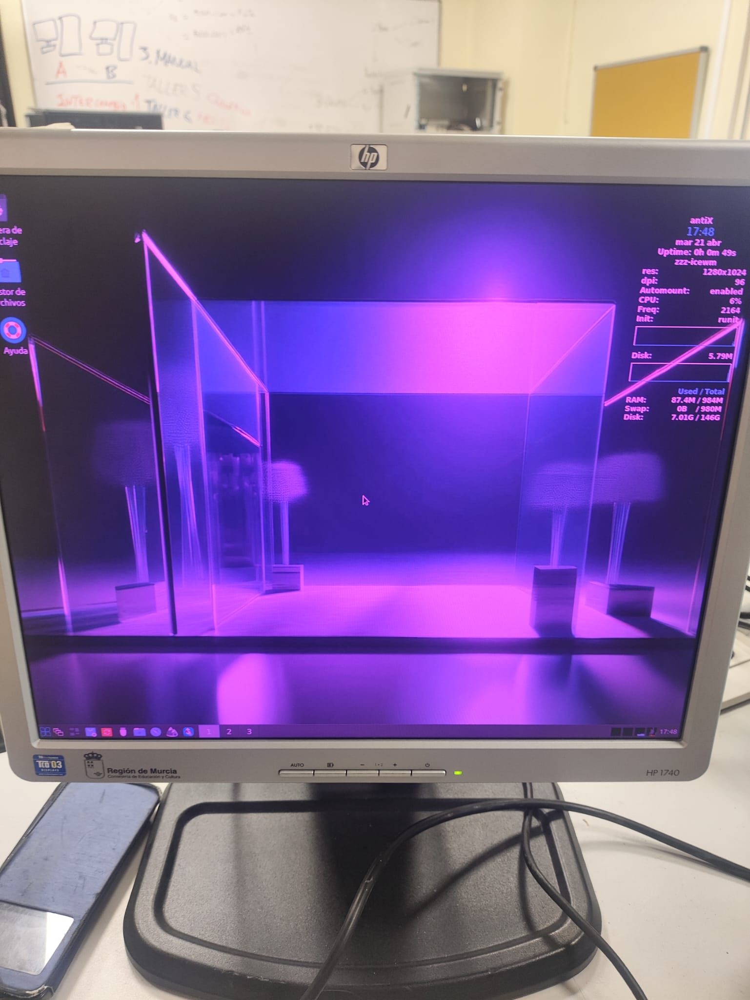

# Informe de Prácticas: Instalación de Linux en Equipo Real

**Alumno:** Abraham Aparicio Moreno  
**Grupo:** 1º ASIR  
**Equipo:** HP Compaq dc7800 SFF  
**Fecha de entrega:** 24/04/2026  

---

## EJERCICIO 1. Preparación del Medio de Instalación (Ventoy)

### 1.1. Configuración del USB
- **Herramienta:** Ventoy (Version 1.1.11.  
- **Método:** Instalación de Ventoy en el pendrive (en mi caso un TOSHIBA de 16GB), ejecutando "Ventoy2Disk.exe", con formato exFAT y copia de archivos ISO mediante arrastrar y soltar.  
- **Arquitectura:** Las ISOs seleccionadas son de 64 bits para aprovechar el procesador Intel Core 2 Duo E6750.  

### 1.2. ISOs incluidas (Validadas en Reto 01)
Se han incluido las tres opciones analizadas en el Reto01 para garantizar el éxito de la instalación:

- **Lubuntu 22.04 LTS:** Opción principal por su equilibrio y entorno LXQt.  
- **Puppy Linux (Fossapup64 9.5):** Alternativa ligera para ejecución en RAM.  
- **Bodhi Linux 7.0.0:** Respaldo basado en Ubuntu con escritorio Moksha.  

**Captura de pantalla requerida:**  

---

## EJERCICIO 2. Proceso de Arranque y Selección

### 2.1. Configuración de la BIOS (Legacy)
Dado que el equipo no posee UEFI, se han seguido estos pasos:

1. Inserción del USB preparado.  
2. Encendido y pulsación de la tecla de menú de arranque (F9 en HP).  
3. Selección del dispositivo USB en el listado de arranque.
4. Guardar y salir

### 2.2. Interfaz de Ventoy en el HP Compaq dc7800
- Se inicia el menú de Ventoy mostrando las tres opciones.  
- **Elección inicial:** antiX 26_3.06 

---

## EJERCICIO 3. Documentación de la Instalación Final

### 3.1. Distribución instalada
antiX 26_3.06

### 3.2. Particionado aplicado
- **Disco duro:** SATA de 160 GB (HDD mecánico).  
- **Esquema de particiones:**  
 Hemos seleccionado la opcion de instalar utilizando todo el disco disponible, para que el sistema automaticamente se particione.

### 3.3. Pasos principales de la instalación
- **Idioma y Teclado:** Configurado en español.  
- **Conexión:** Instalación realizada sin conexión a internet.  
- **Creación de usuario:** Nombre de usuario "admin" con privilegios de administrador.  
- **Particionado USB** Hemos usado el formato exFat en el usb Ventoy en el que teniamos las ISOs

Imágenes del proceso:

### 3.4. Incidencias y soluciones encontradas

Durante la instalación de la ISO de antiX no experimentamos ningun problema o complicación, por ello decidimos probar a intalar una ISO un poco más pesada como es la de Linux Mint, la cual si nos dió un fallo, quedándose la imagen congelada durante el proceso y el equipo sin responder.

| Incidencia detectada | Solución aplicada |
|----------------------|------------------|
| Pantalla se queda congelada durante instalación| Ninguna, porque ya teniamos instalada la ISO de antiX previamente |

### 3.5. Resultado final
- **¿El sistema arranca desde el disco duro?:** Sí
- **Rendimiento observado:** Aceptable/Fluido

**Captura de pantalla final:**  

